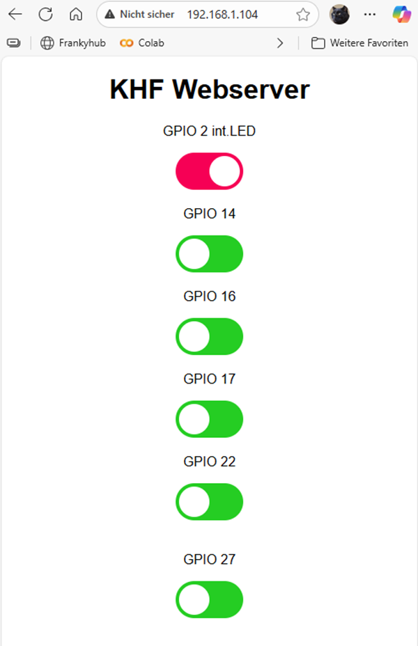

<a name="oben"></a>

<div align="center">

# ESP32 Webserver


|[:skull:ISSUE](https://github.com/frankyhub/ESP32-Webserver/issues?q=is%3Aissue)|[:speech_balloon: Forum /Discussion](https://github.com/frankyhub/ESP32-Webserver/discussions)|[:grey_question:WiKi](https://github.com/frankyhub/ESP32-Webserver/wiki)|
|--|--|--|
| | | | 
| <a href="https://github.com/frankyhub/ESP32-Webserver/pulse" alt="Activity">| <a href="https://github.com/frankyhub/ESP32-Webserver/graphs/traffic">  |<a href="https://github.com/frankyhub?tab=stars"> |


</div>

## Story
Dieses Repo beschreibt einen Websever mit einem ESP32vn IoT UNO. Der Webserver steuert 2 GPIOs. Im Testmodus wird die interne LED GPIO 2 und GPIO 27 angesteuert. Vor dem Programmtest muss noch die SSID und das Passwort für die WLAN-Verbindung eingetragen werden. Das Programm wurde anschließen auf 6 GPIOs erweitert. 

Ein Webserver mit 2 GPIOs und einem ESP8266 NodeMCU V3 ist am Ende des Repos.

---
---

## ESP32 Webserver 


```CPP
/*************************************************************************************************
                                      PROGRAMMINFO
**************************************************************************************************
  Funktion: ESP32 WEB Server 2 GPOI 2 Slider //A00
  
**************************************************************************************************
  Version: 18.12.2022
---------------------------------------------------------------      
*************************************************************************************************
  Board: ESP32vn IoT UNO
**************************************************************************************************
  C++ Arduino IDE V1.8.19
**************************************************************************************************
  Einstellungen:
  https://dl.espressif.com/dl/package_esp32_index.json
  http://dan.drown.org/stm32duino/package_STM32duino_index.json
  https://raw.githubusercontent.com/espressif/arduino-esp32/gh-pages/package_esp32_dev_index.json


  ### Electronik Verbindungen
GPIO 26 //2
GPIO 27

 **************************************************************************************************/

#include <WiFi.h>

// WLAN-Daten
const char* ssid = "xxx";
const char* password = "xxx";

WiFiServer server(80);
String header;

// GPIO-Status
String output26State = "off";
String output27State = "off";

// GPIO-Pins
const int output26 = 2;   // interne LED
const int output27 = 27;

unsigned long currentTime = millis();
unsigned long previousTime = 0;
const long timeoutTime = 2000;

void setup() {
  Serial.begin(115200);
  pinMode(output26, OUTPUT);
  pinMode(output27, OUTPUT);
  digitalWrite(output26, LOW);
  digitalWrite(output27, LOW);

  Serial.print("Verbinde mit WLAN: ");
  Serial.println(ssid);
  WiFi.begin(ssid, password);
  while (WiFi.status() != WL_CONNECTED) {
    delay(500);
    Serial.print(".");
  }
  Serial.println("\nWLAN verbunden!");
  Serial.print("IP-Adresse: ");
  Serial.println(WiFi.localIP());

  server.begin();
}

void loop() {
  WiFiClient client = server.available();

  if (client) {
    currentTime = millis();
    previousTime = currentTime;
    Serial.println("Neuer Client verbunden.");
    String currentLine = "";
    header = "";

    while (client.connected() && currentTime - previousTime <= timeoutTime) {
      currentTime = millis();
      if (client.available()) {
        char c = client.read();
        header += c;
        if (c == '\n') {
          if (currentLine.length() == 0) {
            // ---- HTTP-Antwort ----
            client.println("HTTP/1.1 200 OK");
            client.println("Content-type:text/html");
            client.println("Connection: close");
            client.println();

            // ---- Steuerlogik ----
            if (header.indexOf("GET /26/on") >= 0) {
              output26State = "on"; digitalWrite(output26, HIGH);
              Serial.println("GPIO 26 an");
            } else if (header.indexOf("GET /26/off") >= 0) {
              output26State = "off"; digitalWrite(output26, LOW);
              Serial.println("GPIO 26 aus");
            } else if (header.indexOf("GET /27/on") >= 0) {
              output27State = "on"; digitalWrite(output27, HIGH);
              Serial.println("GPIO 27 an");
            } else if (header.indexOf("GET /27/off") >= 0) {
              output27State = "off"; digitalWrite(output27, LOW);
              Serial.println("GPIO 27 aus");
            }

            // ---- HTML-Seite ----
            client.println("<!DOCTYPE html><html><head>");
            client.println("<meta name=\"viewport\" content=\"width=device-width, initial-scale=1\">");
            client.println("<style>");
            client.println("html{font-family:Helvetica;text-align:center;}");
            client.println(".switch{position:relative;display:inline-block;width:80px;height:44px;}");
            client.println(".switch input{display:none;}");
            client.println(".slider{position:absolute;cursor:pointer;top:0;left:0;right:0;bottom:0;"
                           "background-color:#ccc;transition:.4s;border-radius:34px;}");
            client.println(".slider:before{position:absolute;content:'';height:36px;width:36px;"
                           "left:4px;bottom:4px;background:white;transition:.4s;border-radius:50%;}");
            client.println("input:checked + .slider{background-color:#4CAF50;}");
            client.println("input:checked + .slider:before{transform:translateX(36px);}");
            client.println("</style></head><body>");
            client.println("<h1>KHF Webserver</h1>");

            // GPIO 26
            client.println("<p>Interne LED"  "</p>");
            client.println("<label class=\"switch\">");
            client.print("<input type=\"checkbox\" id=\"gpio26\" ");
            if (output26State == "on") client.print("checked");
            client.println(" onchange=\"toggle(this,26)\">");
            client.println("<span class=\"slider\"></span></label><br><br>");

            // GPIO 27
            client.println("<p>GPIO 27"  "</p>");
            client.println("<label class=\"switch\">");
            client.print("<input type=\"checkbox\" id=\"gpio27\" ");
            if (output27State == "on") client.print("checked");
            client.println(" onchange=\"toggle(this,27)\">");
            client.println("<span class=\"slider\"></span></label>");

            // ---- JavaScript ----
            client.println("<script>");
            client.println("function toggle(el,pin){");
            client.println("var state = el.checked ? 'on' : 'off';");
            client.println("fetch('/'+pin+'/'+state);");
            client.println("}");
            client.println("</script>");

            client.println("</body></html>");
            client.println();
            break;
          } else {
            currentLine = "";
          }
        } else if (c != '\r') {
          currentLine += c;
        }
      }
    }
    // Die header variable löschen
    header = "";
    client.stop();
    Serial.println("Client getrennt.\n");
  }
}


```

---
---

## Webserver Erweiterung



```CPP
/*************************************************************************************************
                                      PROGRAMMINFO
**************************************************************************************************
  Funktion: ESP32 WEB Server 5 GPOI 5 Slider //A00
  
**************************************************************************************************
  Version: 18.12.2022
---------------------------------------------------------------      
*************************************************************************************************
  Board: ESP32vn IoT UNO
**************************************************************************************************
  C++ Arduino IDE V1.8.19
**************************************************************************************************
  Einstellungen:
  https://dl.espressif.com/dl/package_esp32_index.json
  http://dan.drown.org/stm32duino/package_STM32duino_index.json
  https://raw.githubusercontent.com/espressif/arduino-esp32/gh-pages/package_esp32_dev_index.json


  ### Electronik Verbindungen
    GPIO 2
    GPIO 14
    GPIO 16
    GPIO 17
    GPIO 26
    GPIO 27

 **************************************************************************************************/

#include <WiFi.h>

// WLAN-Daten
const char* ssid = "xxx";
const char* password = "xxx";

WiFiServer server(80);
String header;

// GPIO-Status
String output2State =  "off";
String output14State = "off";
String output16State = "off";
String output17State = "off";
String output26State = "off";
String output27State = "off";

// GPIO-Pins
const int output2  = 2; // interne LED
const int output14 = 14; 
const int output16 = 16; 
const int output17 = 17; 
const int output26 = 26;   
const int output27 = 27;

unsigned long currentTime = millis();
unsigned long previousTime = 0;
const long timeoutTime = 2000;

void setup() {
  Serial.begin(115200);
   pinMode(output2,  OUTPUT);
   pinMode(output14, OUTPUT);
   pinMode(output16, OUTPUT);
   pinMode(output17, OUTPUT);
   pinMode(output26, OUTPUT);
   pinMode(output27, OUTPUT);

  digitalWrite(output2,  LOW);
  digitalWrite(output14, LOW);
  digitalWrite(output16, LOW);
  digitalWrite(output17, LOW);
  digitalWrite(output26, LOW);
  digitalWrite(output27, LOW);

  Serial.print("Verbinde mit WLAN: ");
  Serial.println(ssid);
  WiFi.begin(ssid, password);
  while (WiFi.status() != WL_CONNECTED) {
    delay(500);
    Serial.print(".");
  }
  Serial.println("\nWLAN verbunden!");
  Serial.print("IP-Adresse: ");
  Serial.println(WiFi.localIP());

  server.begin();
}

void loop() {
  WiFiClient client = server.available();

  if (client) {
    currentTime = millis();
    previousTime = currentTime;
    Serial.println("Neuer Client verbunden.");
    String currentLine = "";
    header = "";

    while (client.connected() && currentTime - previousTime <= timeoutTime) {
      currentTime = millis();
      if (client.available()) {
        char c = client.read();
        header += c;
        if (c == '\n') {
          if (currentLine.length() == 0) {
            // ---- HTTP-Antwort ----
            client.println("HTTP/1.1 200 OK");
            client.println("Content-type:text/html");
            client.println("Connection: close");
            client.println();

            // ---- Steuerlogik ----

            //GPIO2  
            if (header.indexOf("GET /2/on") >= 0) {
              output2State = "on"; digitalWrite(output2, HIGH);
              Serial.println("GPIO 2 an");
            } else if (header.indexOf("GET /2/off") >= 0) {
              output2State = "off"; digitalWrite(output2, LOW);
              Serial.println("GPIO 2 aus");

            //GPIO14  
            } else if (header.indexOf("GET /14/on") >= 0) {
              output14State = "on"; digitalWrite(output14, HIGH);
              Serial.println("GPIO 14 an");
            } else if (header.indexOf("GET /14/off") >= 0) {
              output14State = "off"; digitalWrite(output14, LOW);
              Serial.println("GPIO 14 aus");

            //GPIO16  
            } else if (header.indexOf("GET /16/on") >= 0) {
              output16State = "on"; digitalWrite(output16, HIGH);
              Serial.println("GPIO 16 an");
            } else if (header.indexOf("GET /16/off") >= 0) {
              output16State = "off"; digitalWrite(output16, LOW);
              Serial.println("GPIO 16 aus"); 

            //GPIO17  
            } else if (header.indexOf("GET /17/on") >= 0) {
              output17State = "on"; digitalWrite(output17, HIGH);
              Serial.println("GPIO 17 an");
            } else if (header.indexOf("GET /17/off") >= 0) {
              output17State = "off"; digitalWrite(output17, LOW);
              Serial.println("GPIO 17 aus"); 

            //GPIO26
            } else if (header.indexOf("GET /26/on") >= 0) {
              output26State = "on"; digitalWrite(output26, HIGH);
              Serial.println("GPIO 26 an");
            } else if (header.indexOf("GET /26/off") >= 0) {
              output26State = "off"; digitalWrite(output26, LOW);
              Serial.println("GPIO 26 aus");

            //GPIO27  
            } else if (header.indexOf("GET /27/on") >= 0) {
              output27State = "on"; digitalWrite(output27, HIGH);
              Serial.println("GPIO 27 an");
            } else if (header.indexOf("GET /27/off") >= 0) {
              output27State = "off"; digitalWrite(output27, LOW);
              Serial.println("GPIO 27 aus");                                        
              
         }

            // ---- HTML-Seite ----
            client.println("<!DOCTYPE html><html><head>");
            client.println("<meta name=\"viewport\" content=\"width=device-width, initial-scale=1\">");
            client.println("<style>");
            client.println("html{font-family:Helvetica;text-align:center;}");
            client.println(".switch{position:relative;display:inline-block;width:80px;height:44px;}");
            client.println(".switch input{display:none;}");
            client.println(".slider{position:absolute;cursor:pointer;top:0;left:0;right:0;bottom:0;"
                           "background-color:#00cc0c;transition:.4s;border-radius:34px;}");
            client.println(".slider:before{position:absolute;content:'';height:36px;width:36px;"
                           "left:4px;bottom:4px;background:white;transition:.4s;border-radius:50%;}");
            client.println("input:checked + .slider{background-color:#fb0052;}"); 
            client.println("input:checked + .slider:before{transform:translateX(36px);}");
            client.println("</style></head><body>");
            client.println("<h1>KHF Webserver</h1>");

            // GPIO 2
            client.println("<p>GPIO 2 int.LED"  "</p>");
            client.println("<label class=\"switch\">");
            client.print("<input type=\"checkbox\" id=\"gpio2\" ");
            if (output2State == "on") client.print("checked");
            client.println(" onchange=\"toggle(this,2)\">");
            client.println("<span class=\"slider\"></span></label>"); 

            // GPIO 14
            client.println("<p>GPIO 14"  "</p>");
            client.println("<label class=\"switch\">");
            client.print("<input type=\"checkbox\" id=\"gpio14\" ");
            if (output14State == "on") client.print("checked");
            client.println(" onchange=\"toggle(this,14)\">");
            client.println("<span class=\"slider\"></span></label>");   

            // GPIO 16
            client.println("<p>GPIO 16"  "</p>");
            client.println("<label class=\"switch\">");
            client.print("<input type=\"checkbox\" id=\"gpio16\" ");
            if (output16State == "on") client.print("checked");
            client.println(" onchange=\"toggle(this,16)\">");
            client.println("<span class=\"slider\"></span></label>"); 

            // GPIO 17
            client.println("<p>GPIO 17"  "</p>");
            client.println("<label class=\"switch\">");
            client.print("<input type=\"checkbox\" id=\"gpio17\" ");
            if (output17State == "on") client.print("checked");
            client.println(" onchange=\"toggle(this,17)\">");
            client.println("<span class=\"slider\"></span></label>");       

            // GPIO 26
            client.println("<p>GPIO 22"  "</p>");
            client.println("<label class=\"switch\">");
            client.print("<input type=\"checkbox\" id=\"gpio26\" ");
            if (output26State == "on") client.print("checked");
            client.println(" onchange=\"toggle(this,26)\">");
            client.println("<span class=\"slider\"></span></label><br><br>");

            // GPIO 27
            client.println("<p>GPIO 27"  "</p>");
            client.println("<label class=\"switch\">");
            client.print("<input type=\"checkbox\" id=\"gpio27\" ");
            if (output27State == "on") client.print("checked");
            client.println(" onchange=\"toggle(this,27)\">");
            client.println("<span class=\"slider\"></span></label>");                                                

            // ---- JavaScript ----
            client.println("<script>");
            client.println("function toggle(el,pin){");
            client.println("var state = el.checked ? 'on' : 'off';");
            client.println("fetch('/'+pin+'/'+state);");
            client.println("}");
            client.println("</script>");
            client.println("</body></html>");
            client.println();
            break;
          } else {
            currentLine = "";
          }
        } else if (c != '\r') {
          currentLine += c;
        }
      }
    }
    // Lösche die header variable
    header = "";
    client.stop();
    Serial.println("Client getrennt.\n");
  }
}

```

---
---

## Programm für das Oberlab-Shield optimiert

```cpp
/*************************************************************************************************
                                      PROGRAMMINFO
**************************************************************************************************
  Funktion: ESP32 WEB Server 5 GPOI 5 Slider //A00
  Angepasst an die Oberlab Header Platine
  
**************************************************************************************************
  Version: 18.12.2022
---------------------------------------------------------------      
*************************************************************************************************
  Board: ESP32vn IoT UNO
**************************************************************************************************
  C++ Arduino IDE V1.8.19
**************************************************************************************************
  Einstellungen:
  https://dl.espressif.com/dl/package_esp32_index.json
  http://dan.drown.org/stm32duino/package_STM32duino_index.json
  https://raw.githubusercontent.com/espressif/arduino-esp32/gh-pages/package_esp32_dev_index.json

 **************************************************************************************************/

#include <WiFi.h>

// WLAN-Daten
const char* ssid = "xxx";
const char* password = "xxx";

WiFiServer server(80);
String header;

// GPIO-Status
String output2State =  "off";
String output4State =  "off";
String output35State = "off";
String output34State = "off";
String output36State = "off";
String output39State = "off";

// GPIO-Pins
const int output2   = 2; // interne LED
const int output4   = 4; 
const int output35 = 35; 
const int output34 = 34; 
const int output36 = 36;   
const int output39 = 39;

unsigned long currentTime = millis();
unsigned long previousTime = 0;
const long timeoutTime = 2000;

void setup() {
  Serial.begin(115200);
   pinMode(output2,  OUTPUT);
   pinMode(output4, OUTPUT);
   pinMode(output35, OUTPUT);
   pinMode(output34, OUTPUT);
   pinMode(output36, OUTPUT);
   pinMode(output39, OUTPUT);

  digitalWrite(output2,  LOW);
  digitalWrite(output4, LOW);
  digitalWrite(output35, LOW);
  digitalWrite(output34, LOW);
  digitalWrite(output36, LOW);
  digitalWrite(output39, LOW);

  Serial.print("Verbinde mit WLAN: ");
  Serial.println(ssid);
  WiFi.begin(ssid, password);
  while (WiFi.status() != WL_CONNECTED) {
    delay(500);
    Serial.print(".");
  }
  Serial.println("\nWLAN verbunden!");
  Serial.print("IP-Adresse: ");
  Serial.println(WiFi.localIP());

  server.begin();
}

void loop() {
  WiFiClient client = server.available();

  if (client) {
    currentTime = millis();
    previousTime = currentTime;
    Serial.println("GPIO schalten: ");
    String currentLine = "";
    header = "";

    while (client.connected() && currentTime - previousTime <= timeoutTime) {
      currentTime = millis();
      if (client.available()) {
        char c = client.read();
        header += c;
        if (c == '\n') {
          if (currentLine.length() == 0) {
            // ---- HTTP-Antwort ----
            client.println("HTTP/1.1 200 OK");
            client.println("Content-type:text/html");
            client.println("Connection: close");
            client.println();

            // ---- Steuerlogik ----

            //GPIO2  
            if (header.indexOf("GET /2/on") >= 0) {
              output2State = "on"; digitalWrite(output2, HIGH);
              Serial.println("GPIO 2 an");
            } else if (header.indexOf("GET /2/off") >= 0) {
              output2State = "off"; digitalWrite(output2, LOW);
              Serial.println("GPIO 2 aus");

            //GPIO14  
            } else if (header.indexOf("GET /4/on") >= 0) {
              output4State = "on"; digitalWrite(output4, HIGH);
              Serial.println("GPIO 4 an");
            } else if (header.indexOf("GET /4/off") >= 0) {
              output4State = "off"; digitalWrite(output4, LOW);
              Serial.println("GPIO 4 aus");

            //GPIO35 
            } else if (header.indexOf("GET /35/on") >= 0) {
              output35State = "on"; digitalWrite(output35, HIGH);
              Serial.println("GPIO 35 an");
            } else if (header.indexOf("GET /35/off") >= 0) {
              output35State = "off"; digitalWrite(output35, LOW);
              Serial.println("GPIO 35 aus"); 

            //GPIO34  
            } else if (header.indexOf("GET /34/on") >= 0) {
              output34State = "on"; digitalWrite(output34, HIGH);
              Serial.println("GPIO 34 an");
            } else if (header.indexOf("GET /34/off") >= 0) {
              output34State = "off"; digitalWrite(output34, LOW);
              Serial.println("GPIO 34 aus"); 

            //GPIO36
            } else if (header.indexOf("GET /36/on") >= 0) {
              output36State = "on"; digitalWrite(output36, HIGH);
              Serial.println("GPIO 36 an");
            } else if (header.indexOf("GET /36/off") >= 0) {
              output36State = "off"; digitalWrite(output36, LOW);
              Serial.println("GPIO 36 aus");

            //GPIO39  
            } else if (header.indexOf("GET /39/on") >= 0) {
              output39State = "on"; digitalWrite(output39, HIGH);
              Serial.println("GPIO 39 an");
            } else if (header.indexOf("GET /39/off") >= 0) {
              output39State = "off"; digitalWrite(output39, LOW);
              Serial.println("GPIO 39 aus");                                        
              
         }

            // ---- HTML-Seite ----
            client.println("<!DOCTYPE html><html><head>");
            client.println("<meta name=\"viewport\" content=\"width=device-width, initial-scale=1\">");
            client.println("<style>");
            client.println("html{font-family:Helvetica;text-align:center;}");
            client.println(".switch{position:relative;display:inline-block;width:80px;height:44px;}");
            client.println(".switch input{display:none;}");
            client.println(".slider{position:absolute;cursor:pointer;top:0;left:0;right:0;bottom:0;"
                           "background-color:#00cc0c;transition:.4s;border-radius:34px;}");
            client.println(".slider:before{position:absolute;content:'';height:36px;width:36px;"
                           "left:4px;bottom:4px;background:white;transition:.4s;border-radius:50%;}");
            client.println("input:checked + .slider{background-color:#fb0052;}"); 
            client.println("input:checked + .slider:before{transform:translateX(36px);}");
            client.println("</style></head><body>");
            client.println("<h1>KHF Webserver</h1>");

            // GPIO 2
            client.println("<p>GPIO 2 int.LED"  "</p>");
            client.println("<label class=\"switch\">");
            client.print("<input type=\"checkbox\" id=\"gpio2\" ");
            if (output2State == "on") client.print("checked");
            client.println(" onchange=\"toggle(this,2)\">");
            client.println("<span class=\"slider\"></span></label>"); 

            // GPIO 4
            client.println("<p>GPIO 4"  "</p>");
            client.println("<label class=\"switch\">");
            client.print("<input type=\"checkbox\" id=\"gpio4\" ");
            if (output4State == "on") client.print("checked");
            client.println(" onchange=\"toggle(this,4)\">");
            client.println("<span class=\"slider\"></span></label>");   

            // GPIO 35
            client.println("<p>GPIO 35"  "</p>");
            client.println("<label class=\"switch\">");
            client.print("<input type=\"checkbox\" id=\"gpio35\" ");
            if (output35State == "on") client.print("checked");
            client.println(" onchange=\"toggle(this,35)\">");
            client.println("<span class=\"slider\"></span></label>"); 

            // GPIO 34
            client.println("<p>GPIO 34"  "</p>");
            client.println("<label class=\"switch\">");
            client.print("<input type=\"checkbox\" id=\"gpio34\" ");
            if (output34State == "on") client.print("checked");
            client.println(" onchange=\"toggle(this,34)\">");
            client.println("<span class=\"slider\"></span></label>");       

            // GPIO 36
            client.println("<p>GPIO 36"  "</p>");
            client.println("<label class=\"switch\">");
            client.print("<input type=\"checkbox\" id=\"gpio36\" ");
            if (output36State == "on") client.print("checked");
            client.println(" onchange=\"toggle(this,36)\">");
            client.println("<span class=\"slider\"></span></label><br><br>");

            // GPIO 39
            client.println("<p>GPIO 39"  "</p>");
            client.println("<label class=\"switch\">");
            client.print("<input type=\"checkbox\" id=\"gpio39\" ");
            if (output39State == "on") client.print("checked");
            client.println(" onchange=\"toggle(this,39)\">");
            client.println("<span class=\"slider\"></span></label>");                                                

            // ---- JavaScript ----
            client.println("<script>");
            client.println("function toggle(el,pin){");
            client.println("var state = el.checked ? 'on' : 'off';");
            client.println("fetch('/'+pin+'/'+state);");
            client.println("}");
            client.println("</script>");
            client.println("</body></html>");
            client.println();
            break;
          } else {
            currentLine = "";
          }
        } else if (c != '\r') {
          currentLine += c;
        }
      }
    }
  }
}
```

---
---

## ESP8266 Webserver mir 2 GPIOs

```CPP
/*************************************************************************************************
                                      PROGRAMMINFO
**************************************************************************************************
Funktion: ESP8266 Web Server mit Schiebeschalter
**************************************************************************************************
Version: 31.10.2025
**************************************************************************************************
ESP8286 Boards (3.8.12): 
LOLIN(WEMOS) D1 R2 & mini
ESPino (ESP12 Module)  NODE MCU V3
**************************************************************************************************
Libraries:
C:\Users\User\Documents\Arduino\libraries
**************************************************************************************************
C++ Arduino IDE V1.8.19
**************************************************************************************************
Einstellungen:
http://arduino.esp8266.com/stable/package_esp8266com_index.json
**************************************************************************************************/

// WLAN-Bibliothek laden
#include <ESP8266WiFi.h>

// WLAN-Zugangsdaten
const char* ssid     = "xxx";
const char* password = "xxx";

// Webserver-Portnummer auf 80 setzen
WiFiServer server(80);

// Variable zum Speichern der HTTP-Anfrage
String header;

// GPIO-Status
String output2State = "off";
String output3State = "off";

// GPIO-Pins
const int output2 = 2;   // interne LED
const int output3 = 3;

unsigned long currentTime = millis();
unsigned long previousTime = 0;
const long timeoutTime = 2000;

void setup() {
  Serial.begin(115200);
  pinMode(output2, OUTPUT);
  pinMode(output3, OUTPUT);

  // GPIO 2 (die interne LED) arbeitet auf einem ESP8266 invertiert.
  // LED beim Start aus (HIGH = LED off bei interner LED)
  digitalWrite(output2, HIGH);
  digitalWrite(output3, LOW);


  Serial.print("Verbinde mit WLAN: ");
  Serial.println(ssid);
  WiFi.begin(ssid, password);
  while (WiFi.status() != WL_CONNECTED) {
    delay(500);
    Serial.print(".");
  }
  Serial.println("\nWLAN verbunden!");
  Serial.print("IP-Adresse: ");
  Serial.println(WiFi.localIP());

  server.begin();
}

void loop() {
  WiFiClient client = server.available();

  if (client) {
    currentTime = millis();
    previousTime = currentTime;
    Serial.println("Neuer Client verbunden.");
    String currentLine = "";
    header = "";

    while (client.connected() && currentTime - previousTime <= timeoutTime) {
      currentTime = millis();
      if (client.available()) {
        char c = client.read();
        header += c;
        if (c == '\n') {
          if (currentLine.length() == 0) {
            // ---- HTTP-Antwort ----
            client.println("HTTP/1.1 200 OK");
            client.println("Content-type:text/html");
            client.println("Connection: close");
            client.println();

            // ---- Steuerlogik ----
            if (header.indexOf("GET /2/on") >= 0) {
              output2State = "on"; digitalWrite(output2, LOW);
              Serial.println("GPIO 2 an");
            } else if (header.indexOf("GET /2/off") >= 0) {
              output2State = "off"; digitalWrite(output2, HIGH);
              Serial.println("GPIO 2 aus");
            } else if (header.indexOf("GET /3/on") >= 0) {
              output3State = "on"; digitalWrite(output3, LOW);
              Serial.println("GPIO 3 an");
            } else if (header.indexOf("GET /3/off") >= 0) {
              output3State = "off"; digitalWrite(output3, HIGH);
              Serial.println("GPIO 3 aus");
            }

            // ---- HTML-Seite ----
            client.println("<!DOCTYPE html><html><head>");
            client.println("<meta name=\"viewport\" content=\"width=device-width, initial-scale=1\">");
            client.println("<style>");
            client.println("html{font-family:Helvetica;text-align:center;}");
            client.println(".switch{position:relative;display:inline-block;width:80px;height:44px;}");
            client.println(".switch input{display:none;}");
            client.println(".slider{position:absolute;cursor:pointer;top:0;left:0;right:0;bottom:0;"
                           "background-color:#ccc;transition:.4s;border-radius:34px;}");
            client.println(".slider:before{position:absolute;content:'';height:36px;width:36px;"
                           "left:4px;bottom:4px;background:white;transition:.4s;border-radius:50%;}");
            client.println("input:checked + .slider{background-color:#4CAF50;}");
            client.println("input:checked + .slider:before{transform:translateX(36px);}");
            client.println("</style></head><body>");
            client.println("<h1>KHF Webserver</h1>");

            // GPIO 2
            client.println("<p>Interne LED"  "</p>");
            client.println("<label class=\"switch\">");
            client.print("<input type=\"checkbox\" id=\"gpio2\" ");
            if (output2State == "on") client.print("checked");
            client.println(" onchange=\"toggle(this,2)\">");
            client.println("<span class=\"slider\"></span></label><br><br>");

            // GPIO 3
            client.println("<p>GPIO 3"  "</p>");
            client.println("<label class=\"switch\">");
            client.print("<input type=\"checkbox\" id=\"gpio3\" ");
            if (output3State == "on") client.print("checked");
            client.println(" onchange=\"toggle(this,3)\">");
            client.println("<span class=\"slider\"></span></label>");

            // ---- JavaScript ----
            client.println("<script>");
            client.println("function toggle(el,pin){");
            client.println("var state = el.checked ? 'on' : 'off';");
            client.println("fetch('/'+pin+'/'+state);");
            client.println("}");
            client.println("</script>");

            client.println("</body></html>");
            client.println();
            break;
          } else {
            currentLine = "";
          }
        } else if (c != '\r') {
          currentLine += c;
        }
      }
    }
    // Die header variable löschen
    header = "";
    client.stop();
    Serial.println("Client getrennt.\n");
  }
}
```

## ESP8266 NodeMCU V3 Pinout


---

<div style="position:absolute; left:2cm; ">   
<ol class="breadcrumb" style="border-top: 2px solid black;border-bottom:2px solid black; height: 45px; width: 900px;"> <p align="center"><a href="#oben">nach oben</a></p></ol>
</div>  

---
