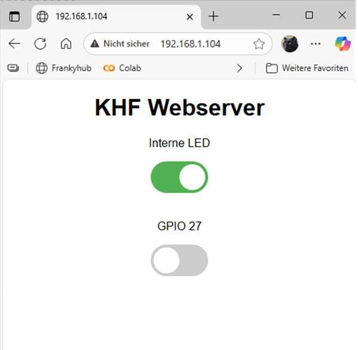

<a name="oben"></a>

<div align="center">

# Objekterkennung mit yolov5


|[:skull:ISSUE](https://github.com/frankyhub/ESP32-Webserver/issues?q=is%3Aissue)|[:speech_balloon: Forum /Discussion](https://github.com/frankyhub/ESP32-Webserver/discussions)|[:grey_question:WiKi](https://github.com/frankyhub/ESP32-Webserver/wiki)|
|--|--|--|
| | | | 
| <a href="https://github.com/frankyhub/ESP32-Webserver/pulse" alt="Activity">| <a href="https://github.com/frankyhub/ESP32-Webserver/graphs/traffic">  |<a href="https://github.com/frankyhub?tab=stars"> |





</div>

## Story
Dieses Repo beschreibt einen Websever mit einem ESP32vn IoT UNO. Der Webserver steuert 2 GPIOs. Im Testmodus wird die interne LED GPIO 2 und GPIO 27 angesteuert. Vor dem Programmtest muss noch die SSID und das Passwort für die WLAN-Verbindung eingetragen werden. Das Programm ist sehr leicht auf mehr als 2 GPIOs erweiterbar.


```CPP
/*************************************************************************************************
                                      PROGRAMMINFO
**************************************************************************************************
  Funktion: ESP32 WEB Server 2 GPOI 2 Slider //A00
  
**************************************************************************************************
  Version: 18.12.2022
---------------------------------------------------------------      
*************************************************************************************************
  Board: ESP32vn IoT UNO
**************************************************************************************************
  C++ Arduino IDE V1.8.19
**************************************************************************************************
  Einstellungen:
  https://dl.espressif.com/dl/package_esp32_index.json
  http://dan.drown.org/stm32duino/package_STM32duino_index.json
  https://raw.githubusercontent.com/espressif/arduino-esp32/gh-pages/package_esp32_dev_index.json


  ### Electronik Verbindungen
GPIO 26 //2
GPIO 27

 **************************************************************************************************/

#include <WiFi.h>

// WLAN-Daten
const char* ssid = "xxx";
const char* password = "xxx";

WiFiServer server(80);
String header;

// GPIO-Status
String output26State = "off";
String output27State = "off";

// GPIO-Pins
const int output26 = 2;   // interne LED
const int output27 = 27;

unsigned long currentTime = millis();
unsigned long previousTime = 0;
const long timeoutTime = 2000;

void setup() {
  Serial.begin(115200);
  pinMode(output26, OUTPUT);
  pinMode(output27, OUTPUT);
  digitalWrite(output26, LOW);
  digitalWrite(output27, LOW);

  Serial.print("Verbinde mit WLAN: ");
  Serial.println(ssid);
  WiFi.begin(ssid, password);
  while (WiFi.status() != WL_CONNECTED) {
    delay(500);
    Serial.print(".");
  }
  Serial.println("\nWLAN verbunden!");
  Serial.print("IP-Adresse: ");
  Serial.println(WiFi.localIP());

  server.begin();
}

void loop() {
  WiFiClient client = server.available();

  if (client) {
    currentTime = millis();
    previousTime = currentTime;
    Serial.println("Neuer Client verbunden.");
    String currentLine = "";
    header = "";

    while (client.connected() && currentTime - previousTime <= timeoutTime) {
      currentTime = millis();
      if (client.available()) {
        char c = client.read();
        header += c;
        if (c == '\n') {
          if (currentLine.length() == 0) {
            // ---- HTTP-Antwort ----
            client.println("HTTP/1.1 200 OK");
            client.println("Content-type:text/html");
            client.println("Connection: close");
            client.println();

            // ---- Steuerlogik ----
            if (header.indexOf("GET /26/on") >= 0) {
              output26State = "on"; digitalWrite(output26, HIGH);
              Serial.println("GPIO 26 an");
            } else if (header.indexOf("GET /26/off") >= 0) {
              output26State = "off"; digitalWrite(output26, LOW);
              Serial.println("GPIO 26 aus");
            } else if (header.indexOf("GET /27/on") >= 0) {
              output27State = "on"; digitalWrite(output27, HIGH);
              Serial.println("GPIO 27 an");
            } else if (header.indexOf("GET /27/off") >= 0) {
              output27State = "off"; digitalWrite(output27, LOW);
              Serial.println("GPIO 27 aus");
            }

            // ---- HTML-Seite ----
            client.println("<!DOCTYPE html><html><head>");
            client.println("<meta name=\"viewport\" content=\"width=device-width, initial-scale=1\">");
            client.println("<style>");
            client.println("html{font-family:Helvetica;text-align:center;}");
            client.println(".switch{position:relative;display:inline-block;width:80px;height:44px;}");
            client.println(".switch input{display:none;}");
            client.println(".slider{position:absolute;cursor:pointer;top:0;left:0;right:0;bottom:0;"
                           "background-color:#ccc;transition:.4s;border-radius:34px;}");
            client.println(".slider:before{position:absolute;content:'';height:36px;width:36px;"
                           "left:4px;bottom:4px;background:white;transition:.4s;border-radius:50%;}");
            client.println("input:checked + .slider{background-color:#4CAF50;}");
            client.println("input:checked + .slider:before{transform:translateX(36px);}");
            client.println("</style></head><body>");
            client.println("<h1>KHF Webserver</h1>");

            // GPIO 26
            client.println("<p>Interne LED"  "</p>");
            client.println("<label class=\"switch\">");
            client.print("<input type=\"checkbox\" id=\"gpio26\" ");
            if (output26State == "on") client.print("checked");
            client.println(" onchange=\"toggle(this,26)\">");
            client.println("<span class=\"slider\"></span></label><br><br>");

            // GPIO 27
            client.println("<p>GPIO 27"  "</p>");
            client.println("<label class=\"switch\">");
            client.print("<input type=\"checkbox\" id=\"gpio27\" ");
            if (output27State == "on") client.print("checked");
            client.println(" onchange=\"toggle(this,27)\">");
            client.println("<span class=\"slider\"></span></label>");

            // ---- JavaScript ----
            client.println("<script>");
            client.println("function toggle(el,pin){");
            client.println("var state = el.checked ? 'on' : 'off';");
            client.println("fetch('/'+pin+'/'+state);");
            client.println("}");
            client.println("</script>");

            client.println("</body></html>");
            client.println();
            break;
          } else {
            currentLine = "";
          }
        } else if (c != '\r') {
          currentLine += c;
        }
      }
    }
    // Clear the header variable
    header = "";
    client.stop();
    Serial.println("Client getrennt.\n");
  }
}


```

---

<div style="position:absolute; left:2cm; ">   
<ol class="breadcrumb" style="border-top: 2px solid black;border-bottom:2px solid black; height: 45px; width: 900px;"> <p align="center"><a href="#oben">nach oben</a></p></ol>
</div>  

---
